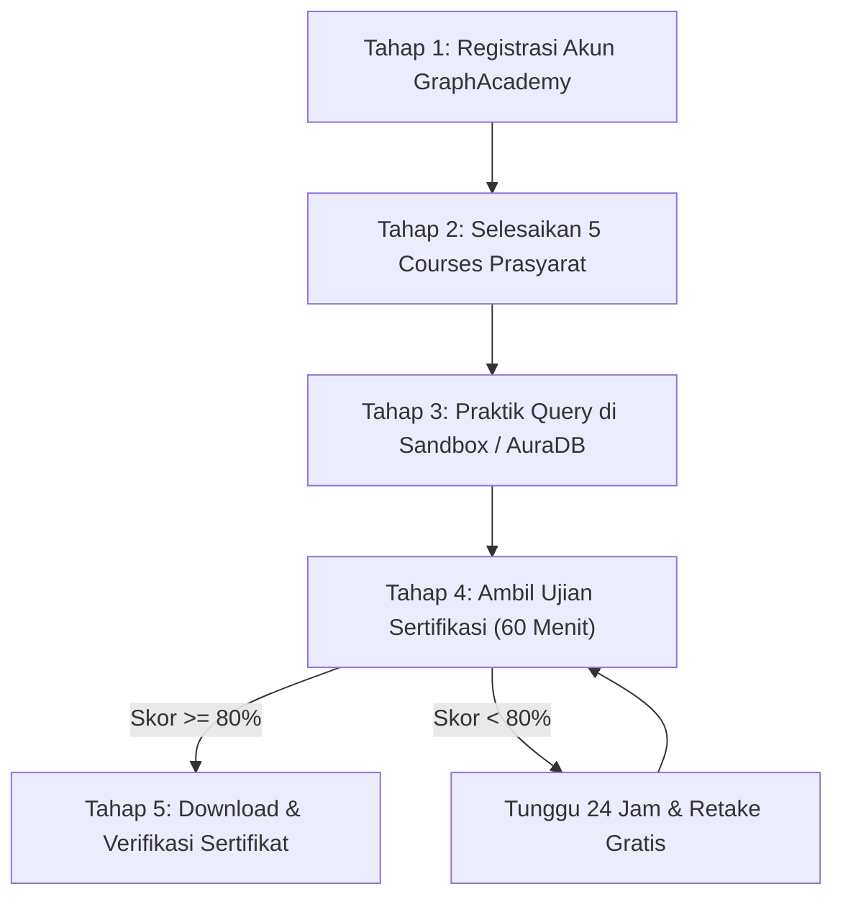

# MAKALAH PANDUAN SERTIFIKASI INTERNASIONAL
## PENGERJAAN SERTIFIKASI NEO4J CERTIFIED PROFESSIONAL SECARA MANDIRI PADA PLATFORM NEO4J GRAPHACADEMY

---

### METADATA DOKUMEN & METADATA SERTIFIKASI (STUDI KASUS)
* **Judul Makalah**: Panduan Komprehensif, Silabus Ujian, Strategi Pembelajaran, Latihan Soal Cypher Query, dan Prosedur Verifikasi Sertifikat Digital Neo4j Certified Professional
* **Nama Pemegang Sertifikat**: Tito Salasa
* **Penyelenggara / Penerbit**: Neo4j GraphAcademy (Official Learning & Certification Platform)
* **Tanggal Penerbitan**: 7 Agustus 2026
* **Status Sertifikasi**: VERIFIED CERTIFICATE (Aktif & Terverifikasi Resmi)
* **ID Verifikasi Sertifikat**: `ffcbd2b7-1c98-4e5a-ac12-c2b7f94949f1`
* **Portal Resmi**: [https://graphacademy.neo4j.com/](https://graphacademy.neo4j.com/)
* **URL Verifikasi Sertifikat**: [https://graphacademy.neo4j.com/certificates/ffcbd2b7-1c98-4e5a-ac12-c2b7f94949f1](https://graphacademy.neo4j.com/certificates/ffcbd2b7-1c98-4e5a-ac12-c2b7f94949f1)

---

## DAFTAR ISI
1. [BAB I: PENDAHULUAN](#bab-i-pendahuluan)
   - [1.1 Latar Belakang Graph Database & Neo4j](#11-latar-belakang-graph-database--neo4j)
   - [1.2 Tujuan Penulisan Makalah](#12-tujuan-penulisan-makalah)
   - [1.3 Manfaat Sertifikasi Neo4j Certified Professional](#13-manfaat-sertifikasi-neo4j-certified-professional)
2. [BAB II: DESKRIPSI & SILABUS SERTIFIKASI](#bab-ii-deskripsi--silabus-sertifikasi)
   - [2.1 Spesifikasi Ujian Sertifikasi](#21-spesifikasi-ujian-sertifikasi)
   - [2.2 5 Core Domain Ujian Sertifikasi & Penjelasan Rinci](#22-5-core-domain-ujian-sertifikasi--penjelasan-rinci)
3. [BAB III: LANGKAH-LANGKAH PENGERJAAN MANDIRI (STEP-BY-STEP)](#bab-iii-langkah-langkah-pengerjaan-mandiri-step-by-step)
   - [3.1 Tahap 1: Registrasi & Konfigurasi Akun Neo4j GraphAcademy](#31-tahap-1-registrasi--konfigurasi-akun-neo4j-graphacademy)
   - [3.2 Tahap 2: Penyelesaian Learning Path Rekomendasi](#32-tahap-2-penyelesaian-learning-path-rekomendasi)
   - [3.3 Tahap 3: Persiapan Hands-On Lab (Neo4j Sandbox & AuraDB)](#33-tahap-3-persiapan-hands-on-lab-neo4j-sandbox--auradb)
   - [3.4 Tahap 4: Pelaksanaan Ujian Online & Strategi Manajemen Waktu](#34-tahap-4-pelaksanaan-ujian-online--strategi-manajemen-waktu)
   - [3.5 Tahap 5: Penerbitan, Pengunduhan PDF, & Verifikasi Sertifikat](#35-tahap-5-penerbitan-pengunduhan-pdf--verifikasi-sertifikat)
4. [BAB IV: CONTOH LATIHAN SOAL & STRATEGI PEMBAHASAN](#bab-iv-contoh-latihan-soal--strategi-pembahasan)
   - [4.1 Latihan Soal Domain Cypher Query & Pattern Matching](#41-latihan-soal-domain-cypher-query--pattern-matching)
   - [4.2 Latihan Soal Domain Graph Data Modeling](#42-latihan-soal-domain-graph-data-modeling)
   - [4.3 Latihan Soal Domain Data Import (LOAD CSV)](#43-latihan-soal-domain-data-import-load-csv)
   - [4.4 Tips & Trik Utama Kelulusan Ujian Sertifikasi](#44-tips--trik-utama-kelulusan-ujian-sertifikasi)
5. [BAB V: PENUTUP](#bab-v-penutup)
   - [5.1 Kesimpulan](#51-kesimpulan)
   - [5.2 Saran & Langkah Lanjutan Karier](#52-saran--langkah-lanjutan-karier)
6. [DAFTAR PUSTAKA & REFERENSI RESMI](#daftar-pustaka--referensi-resmi)

---

## BAB I: PENDAHULUAN

### 1.1 Latar Belakang Graph Database & Neo4j
Di era arsitektur data modern, data tidak lagi hanya berdiri sebagai catatan terisolasi, melainkan saling terhubung secara kompleks. Basis Data Relasional (RDBMS) tradisional seperti MySQL, PostgreSQL, atau Oracle dirancang pada era 1970-an untuk mengoptimalkan penyimpanan struktur tabel dua dimensi (baris dan kolom). Namun, ketika aplikasi modern dihadapkan pada query yang melibatkan keterhubungan mendalam (*multi-hop relationships*)—seperti analisis jaringan sosial, sistem rekomendasi (*recommendation engine*), deteksi kecurangan (*fraud detection*), manajemen rantai pasok (*supply chain*), dan *Knowledge Graphs* untuk AI—RDBMS mengalami penurunan performa drastis akibat operasi `JOIN` berantai yang sangat mahal secara komputasi.

**Graph Database** hadir sebagai paradigma baru dalam manajemen data. Berbeda dengan RDBMS yang melakukan kalkulasi relasi saat query dijalankan (query-time join), basis data grafik berbasis **Labeled Property Graph (LPG)** menyimpan relasi secara langsung sebagai entitas fisik di dalam media penyimpanan (*storage-level adjacency*). 

**Neo4j** adalah platform *Native Graph Database* nomor satu di dunia. Dengan arsitektur *Index-Free Adjacency*, penelusuran hubungan antar data di Neo4j memiliki kompleksitas waktu $O(1)$ untuk setiap langkah traversal, terlepas dari seberapa besar total ukuran database. Untuk memastikan kesiapan dan kompetensi praktisi data di tingkat global, Neo4j menyediakan program sertifikasi resmi bernama **Neo4j Certified Professional** melalui platform **Neo4j GraphAcademy**.

---

### 1.2 Tujuan Penulisan Makalah
Makalah ini disusun secara sistematis untuk memenuhi tujuan-tujuan berikut:
1. **Memberikan Panduan Langkah-demi-Langkah**: Menjelaskan alur pengerjaan sertifikasi *Neo4j Certified Professional* secara mandiri, mulai dari tahap pendaftaran hingga klaim sertifikat digital.
2. **Membedah Silabus & Materi Ujian**: Menguraikan 5 domain kompetensi utama yang diujikan dalam sertifikasi Neo4j GraphAcademy.
3. **Menyediakan Analisis & Pembahasan Soal**: Memberikan latihan soal teknis berbahasa Cypher query beserta penjelasan logis dari setiap opsi jawaban.
4. **Menjelaskan Metode Verifikasi Sertifikat**: Menyajikan prosedur validasi sertifikat digital resmi menggunakan ID Verifikasi publik (`ffcbd2b7-1c98-4e5a-ac12-c2b7f94949f1` atas nama Tito Salasa).

---

### 1.3 Manfaat Sertifikasi Neo4j Certified Professional
Mendapatkan sertifikasi internasional *Neo4j Certified Professional* memberikan berbagai manfaat strategis:
* **Pengakuan Kompetensi Global**: Membuktikan secara resmi bahwa pemegang sertifikat menguasai konsep dasar Graph Database dan sintaks bahasa query Cypher standar industri.
* **Keunggulan Portofolio Profesional**: Meningkatkan nilai jual profil profesional di platform seperti LinkedIn, GitHub, dan CV dalam persaingan dunia kerja Data Engineering, Data Science, dan Software Architecture.
* **Validasi Keahlian Praktis**: Memastikan praktisi mampu mendesain model data grafis yang efisien, melakukan *query optimization*, serta mengimpor data skala besar secara aman.

---

## BAB II: DESKRIPSI & SILABUS SERTIFIKASI

### 2.1 Spesifikasi Ujian Sertifikasi
Ujian sertifikasi Neo4j Certified Professional diselenggarakan penuh secara online di platform **Neo4j GraphAcademy**. Rincian spesifikasi teknis ujian ditunjukkan pada tabel di bawah ini:

| Parameter Ujian | Keterangan & Ketentuan Resmi |
| :--- | :--- |
| **Nama Sertifikasi** | Neo4j Certified Professional |
| **Penyelenggara** | Neo4j GraphAcademy (`graphacademy.neo4j.com`) |
| **Biaya Pendaftaran** | **100% Gratis (Free of Charge)** tanpa biaya tersembunyi |
| **Jumlah Pertanyaan** | 80 Soal (Pilihan Ganda / Multiple Choice & Multi-Select) |
| **Durasi Ujian** | 60 Menit (1 Jam nonstop) |
| **Ambang Kelulusan** | **80%** (Peserta wajib menjawab benar minimal 64 dari 80 soal) |
| **Kebijakan Mengulang (Retake)** | Jika tidak lulus, peserta dapat mengulang ujian secara gratis setelah 24 jam |
| **Masa Berlaku** | Berlaku seumur hidup (Lifetime) / Sesuai major version engine |
| **Bentuk Kredensial** | Sertifikat Digital PDF, Badge Digital, dan Link Verifikasi Resmi |

---

### 2.2 5 Core Domain Ujian Sertifikasi & Penjelasan Rinci

Ujian mencakup 5 domain utama yang menguji aspek teoritis dan praktis:

```
+-------------------------------------------------------------------+
|               DISTRIBUSI BOBOT DOMAIN UJIAN NEO4J                  |
+-------------------------------------------------------------------+
| [1] Cypher Query Language        : 35%  [██████████████████████]  |
| [2] Graph Data Modeling          : 20%  [█████████████]           |
| [3] Graph Database Concepts      : 20%  [█████████████]           |
| [4] Data Import (LOAD CSV)       : 15%  [█████████]               |
| [5] Neo4j Admin & Performance    : 10%  [██████]                  |
+-------------------------------------------------------------------+
```

#### Point 1: Graph Database Concepts & Terminology (Bobot 20%)
* **Penjelasan**: Domain ini menguji pemahaman teoritis tentang struktur *Labeled Property Graph (LPG)*. Peserta harus memahami bahwa entitas diwakili oleh **Nodes**, hubungan antar-entitas diwakili oleh **Relationships** (yang selalu memiliki arah/directed dan tipe/type), serta atribut tambahan yang disimpan dalam kunci-nilai (**Properties**) baik pada Node maupun Relationship.
* **Topik Utama**: Perbedaan RDBMS vs LPG, keunggulan *Index-Free Adjacency*, penggunaan Node Labels, dan struktur internal grafik.

#### Point 2: Cypher Query Language (Bobot 35%)
* **Penjelasan**: Domain ini memiliki bobot terbesar. Cypher adalah bahasa query deklaratif yang dirancang khusus untuk Graph Database (serupa dengan SQL untuk RDBMS). Peserta wajib menguasai penulisan pola (*pattern matching*).
* **Topik Utama**:
  * Klausa Pembacaan: `MATCH`, `OPTIONAL MATCH`, `WHERE`, `RETURN`, `ORDER BY`, `SKIP`, `LIMIT`.
  * Klausa Penulisan: `CREATE`, `MERGE`, `SET`, `DELETE`, `REMOVE`.
  * Agregasi & Pemrosesan Data: `count()`, `collect()`, `sum()`, `avg()`, penggunaan `WITH` untuk *query chaining*, dan `UNWIND` untuk pembongkaran array/list.

#### Point 3: Graph Data Modeling (Bobot 20%)
* **Penjelasan**: Menguji kemampuan peserta dalam merancang model data grafis yang efisien berdasarkan kebutuhan kueri (*query-driven data modeling*).
* **Topik Utama**: Menentukan kapan suatu konsep dijadikan Node vs Property vs Relationship, penanganan relasi n-ary, menghindari antipattern (seperti relasi tanpa tipe atau node berlebihan), serta teknik refactoring grafik.

#### Point 4: Data Import into Neo4j (Bobot 15%)
* **Penjelasan**: Menguji teknik memasukkan data dari sumber eksternal (terutama file CSV) ke dalam database grafik.
* **Topik Utama**: Penggunaan perintah `LOAD CSV WITH HEADERS FROM 'URL'`, konversi tipe data (`toInteger()`, `toFloat()`, `boolean()`), penanganan nilai `null`, dan pengelolaan transaksi massal menggunakan `USING PERIODIC COMMIT` atau `CALL { ... } IN TRANSACTIONS`.

#### Point 5: Neo4j Administration & Performance Basics (Bobot 10%)
* **Penjelasan**: Menguji pengetahuan dasar operasional database Neo4j, pembuatan indeks, dan penegakan integritas data.
* **Topik Utama**: Pembuatan Constraints (`IS UNIQUE`, `IS NOT NULL`), pembuatan Index (Range Index, Text Index), analisis rencana eksekusi query (`EXPLAIN` dan `PROFILE`), serta perintah manajemen skema.

---

## BAB III: LANGKAH-LANGKAH PENGERJAAN MANDIRI (STEP-BY-STEP)

Berikut adalah panduan langkah demi langkah untuk menyelesaikan sertifikasi secara mandiri:



### 3.1 Tahap 1: Registrasi & Konfigurasi Akun Neo4j GraphAcademy
1. **Buka Portal Resmi**: Akses browser dan kunjungi [https://graphacademy.neo4j.com/](https://graphacademy.neo4j.com/).
2. **Proses Pendaftaran**: Klik tombol **Sign In** di pojok kanan atas. Anda dapat mendaftar menggunakan *Single Sign-On (SSO)* akun Google atau GitHub, atau menggunakan pendaftaran email manual.
3. **Pengaturan Profil**: Masuk ke menu profil pengguna. **Pastikan Nama Lengkap ditulis dengan benar** (misalnya: `Tito Salasa`), karena nama yang tertera pada akun akan secara otomatis dicetak pada sertifikat PDF resmi dan badge verifikasi.

---

### 3.2 Tahap 2: Penyelesaian Learning Path Rekomendasi
Sebelum mengklik tombol ujian, sangat disarankan untuk menyelesaikan 5 modul pelatihan gratis berikut secara berurutan:

1. **Course 1: Neo4j Fundamentals** (~1 Jam)
   * *Penjelasan*: Mempelajari konsep mendasar tentang grafik, nodus, relasi, dan perbandingannya dengan tabel RDBMS.
2. **Course 2: Cypher Fundamentals** (~2 Jam)
   * *Penjelasan*: Menguasai sintaksis dasar Cypher: membaca node `MATCH (m:Movie)`, memfilter dengan `WHERE`, dan membuat data dengan `CREATE` / `MERGE`.
3. **Course 3: Intermediate Cypher Queries** (~2 Jam)
   * *Penjelasan*: Mempelajari pembentukan struktur query tingkat lanjut, pemrosesan daftar (*list processing*), agregasi `collect()`, serta penggabungan klausa menggunakan `WITH`.
4. **Course 4: Graph Data Modeling Fundamentals** (~2 Jam)
   * *Penjelasan*: Mempelajari alur kerja mendesain skema grafik: mengidentifikasi entitas, relasi, properti, dan menguji model terhadap *use-case query*.
5. **Course 5: Importing CSV Data into Neo4j** (~1.5 Jam)
   * *Penjelasan*: Menguasai klausa `LOAD CSV`, membersihkan data CSV, mengonversi tipe data, dan membuat node/relasi secara otomatis dari file CSV.

---

### 3.3 Tahap 3: Persiapan Hands-On Lab (Neo4j Sandbox & AuraDB)
Teori tanpa praktik akan menyulitkan saat ujian. Neo4j menyediakan 2 lingkungan database gratis untuk latihan:
* **Neo4j Sandbox** ([sandbox.neo4j.com](https://sandbox.neo4j.com/)): Instance cloud otomatis selama 3 hari (dapat diperpanjang) yang dilengkapi dataset siap pakai seperti *Movies*, *Northwind Retail*, dan *Twitter Network*.
* **Neo4j AuraDB Free** ([neo4j.com/cloud/aura/](https://neo4j.com/cloud/aura/)): Instance database grafik permanen gratis di cloud yang dapat dihubungkan via Neo4j Browser untuk menulis dan mengeksekusi query Cypher secara langsung.

---

### 3.4 Tahap 4: Pelaksanaan Ujian Online & Strategi Manajemen Waktu
1. **Akses Halaman Ujian**: Buka tautan [https://graphacademy.neo4j.com/courses/neo4j-certified-professional/](https://graphacademy.neo4j.com/courses/neo4j-certified-professional/).
2. **Mulai Ujian**: Klik **Take Exam**. Timer 60 menit akan mulai berjalan secara otomatis.
3. **Strategi Manajemen Waktu (Time Allocation)**:
   * Total soal: 80 soal. Total waktu: 3.600 detik (60 menit).
   * **Target Alokasi Waktu**: Maksimal **45 detik per soal**.
   * Kerjakan soal-soal teori konsep (*Graph Concepts*) yang singkat terlebih dahulu.
   * Jangan tertahan lebih dari 1,5 menit pada satu soal query Cypher yang panjang. Tandai dan lewati terlebih dahulu, lalu kembali lagi di akhir ujian.
4. **Ketelitian Sintaksis**: Perhatikan detail tanda baca Cypher:
   * Node menggunakan kurung biasa: `(n:Person)`
   * Relationship menggunakan kurung siku: `[r:KNOWS]`
   * Label dan Type bersifat *case-sensitive* (sensitif huruf besar/kecil).

---

### 3.5 Tahap 5: Penerbitan, Pengunduhan PDF, & Verifikasi Sertifikat
Jika Anda berhasil meraih nilai minimal **80%**, sistem akan secara otomatis menampilkan halaman ucapan selamat dan menerbitkan sertifikat digital.

#### Langkah Verifikasi Keabsahan Sertifikat:
1. **Mengunduh File PDF**: Klik tombol **Download Certificate** untuk mendapatkan file PDF resmi.
2. **Pengecekan Tautan Verifikasi Publik**:
   * Setiap sertifikat memiliki **Certificate ID** unik (Contoh pada studi kasus: `ffcbd2b7-1c98-4e5a-ac12-c2b7f94949f1`).
   * Tautan verifikasi publik dapat diakses secara terbuka melalui browser di URL:
     `https://graphacademy.neo4j.com/certificates/ffcbd2b7-1c98-4e5a-ac12-c2b7f94949f1`
3. **Pemeriksaan Visual**: Halaman verifikasi resmi akan menampilkan teks **VERIFIED CERTIFICATE** berwarna hijau, Nama Pemegang (`Tito Salasa`), Nama Sertifikasi (`Neo4j Certified Professional`), serta Tanggal Penerbitan (`August 7, 2026`).

---

## BAB IV: CONTOH LATIHAN SOAL & STRATEGI PEMBAHASAN

Berikut adalah contoh latihan soal teknis yang merepresentasikan soal ujian asli beserta pembahasan penjelasannya:

### 4.1 Latihan Soal Domain Cypher Query & Pattern Matching

#### Soal 1 (Pencarian & Pembuatan Relasi Efisien)
Diberikan dua node yang sudah ada di database: `Person` dengan nama `'Tito Salasa'` dan `Course` dengan judul `'Graph Modeling'`. Manakah query Cypher yang BENAR untuk membuat relasi `:COMPLETED` hanya jika relasi tersebut belum pernah dibuat sebelumnya?

```cypher
-- Pilihan A
MATCH (p:Person {name: 'Tito Salasa'}), (c:Course {title: 'Graph Modeling'})
CREATE (p)-[r:COMPLETED]->(c)
RETURN r;

-- Pilihan B (BENAR)
MATCH (p:Person {name: 'Tito Salasa'}), (c:Course {title: 'Graph Modeling'})
MERGE (p)-[r:COMPLETED]->(c)
RETURN r;

-- Pilihan C
MATCH (p:Person {name: 'Tito Salasa'})-[r:COMPLETED]->(c:Course {title: 'Graph Modeling'})
CREATE (r)
RETURN r;
```

* **Penjelasan / Pembahasan**:
  * Pilihan A **Salah** karena klausa `CREATE` akan selalu membuat relasi baru setiap kali query dijalankan, sehingga menyebabkan duplikasi relasi jika query dijalankan berulang kali.
  * Pilihan B **BENAR** karena klausa `MERGE` bertindak sebagai *Match or Create*. `MERGE` pertama-tama akan memeriksa apakah pola relasi `(p)-[:COMPLETED]->(c)` sudah ada. Jika belum ada, relasi dibuat; jika sudah ada, tidak ada duplikasi data.
  * Pilihan C **Salah** karena sintaks `CREATE (r)` tidak valid dalam Cypher.

---

#### Soal 2 (Agregasi Data & Pengurutan)
Manakah perintah Cypher yang benar untuk menampilkan 3 nama Penulis (`Author`) yang telah menerbitkan buku terbanyak beserta jumlah bukunya?

```cypher
MATCH (a:Author)-[:WROTE]->(b:Book)
RETURN a.name AS AuthorName, count(b) AS TotalBooks
ORDER BY TotalBooks DESC
LIMIT 3;
```

* **Penjelasan / Pembahasan**:
  * Fungsi `count(b)` menghitung jumlah node `Book` yang terhubung ke masing-masing `Author`.
  * Dalam Cypher, klausa `RETURN` yang menggabungkan kolom biasa (`a.name`) dan fungsi agregasi (`count(b)`) akan secara otomatis mengelompokkan data (*implicit GROUP BY*) berdasarkan `a.name`.
  * `ORDER BY TotalBooks DESC` mengurutkan dari jumlah buku terbanyak ke terkecil.
  * `LIMIT 3` membatasi hasil hanya pada 3 baris teratas.

---

### 4.2 Latihan Soal Domain Graph Data Modeling

#### Soal 3 (Karakteristik Relasi pada Storage Engine)
Manakah pernyataan di bawah ini yang BENAR mengenai sifat relasi (*Relationships*) pada Neo4j Labeled Property Graph?

* A. Relasi di Neo4j dapat disimpan tanpa arah (*undirected*) di dalam disk storage.
* B. **Relasi di Neo4j harus selalu memiliki arah (directed) dan tipe (type) saat disimpan di disk.** *(BENAR)*
* C. Dua node di Neo4j hanya boleh dihubungkan oleh maksimal satu relasi.
* D. Relasi di Neo4j tidak dapat menyimpan properti.

* **Penjelasan / Pembahasan**:
  * Pernyataan A **Salah**: Di tingkat penyimpanan fisik (*physical storage*), setiap relasi di Neo4j **WAJIB memiliki arah** dari *Start Node* ke *End Node*. Namun, saat melakukan query `MATCH (a)-(b)`, kita bebas mengabaikan arahnya secara logis.
  * Pernyataan B **BENAR**: Setiap relasi wajib memiliki tepat 1 *Relationship Type* dan 1 arah spesifik.
  * Pernyataan C **Salah**: Dua node dapat dihubungkan oleh banyak relasi (*multiple relationships*) dengan tipe berbeda.
  * Pernyataan D **Salah**: Relasi di Neo4j dapat menyimpan properti (key-value pairs) seperti atribut `date`, `weight`, atau `score`.

---

### 4.3 Latihan Soal Domain Data Import (LOAD CSV)

#### Soal 4 (Konversi Tipe Data pada Impor CSV)
Diberikan baris file CSV `users.csv` yang berisi kolom `user_id,name,age`. Mengapa query di bawah ini berpotensi menimbulkan kesalahan tipe data jika properti `age` akan digunakan dalam operasi matematika di masa mendatang?

```cypher
LOAD CSV WITH HEADERS FROM 'file:///users.csv' AS row
CREATE (u:User {id: row.user_id, name: row.name, age: row.age});
```

* **Penjelasan & Solusi Pembahasan**:
  * **Masalah**: Perintah `LOAD CSV` membaca **semua kolom file CSV sebagai tipe data String (teks)**. Tanpa konversi eksplisit, properti `age` akan tersimpan sebagai teks `"25"` bukan angka `25`.
  * **Solusi Query yang Benar**:
    ```cypher
    LOAD CSV WITH HEADERS FROM 'file:///users.csv' AS row
    CREATE (u:User {
      id: toInteger(row.user_id),
      name: row.name,
      age: toInteger(row.age)
    });
    ```
  * Menggunakan fungsi `toInteger()` memastikan nilai `age` disimpan sebagai numerik bilangan bulat.

---

### 4.4 Tips & Trik Utama Kelulusan Ujian Sertifikasi

1. **Kuasai Perbedaan `MATCH` vs `OPTIONAL MATCH`**: `MATCH` akan membatalkan baris hasil jika pola tidak ditemukan (serupa dengan `INNER JOIN`), sedangkan `OPTIONAL MATCH` akan mengembalikan `null` jika pola tidak ditemukan (serupa dengan `LEFT OUTER JOIN`).
2. **Ingat Aturan Pembuatan Indeks**:
   * Perintah pembuatan Unique Constraint otomatis membuat indeks pendukung:
     `CREATE CONSTRAINT FOR (p:Person) REQUIRE p.id IS UNIQUE;`
3. **Teknik Eliminasi Jawaban**: Jika melihat opsi jawaban dengan sintaks relasi yang salah (misalnya `(a)<-[:TYPE->(b)` atau tanpa kurung siku `(a)-TYPE->(b)`), Anda dapat langsung mengeliminasi opsi tersebut tanpa ragu.

---

## BAB V: PENUTUP

### 5.1 Kesimpulan
Sertifikasi **Neo4j Certified Professional** merupakan tolok ukur standar internasional yang menguji keahlian praktis dan teoritis seorang profesional data dalam teknologi basis data grafik Neo4j. 

Melalui penyusunan makalah ini, telah dibuktikan bahwa proses pengerjaan sertifikasi dapat dilakukan secara **mandiri, 100% gratis, dan terstruktur** melalui portal **Neo4j GraphAcademy**. Dengan menguasai 5 domain kompetensi utama (terutamanya bahasa query Cypher dan prinsip Graph Data Modeling) serta mengikuti langkah-langkah persiapan yang tepat, tingkat kelulusan peserta dapat dicapai secara maksimal.

---

### 5.2 Saran & Langkah Lanjutan Karier
Bagi peserta yang telah berhasil memperoleh sertifikasi *Neo4j Certified Professional* (seperti yang dicapai oleh **Tito Salasa** dengan ID Verifikasi `ffcbd2b7-1c98-4e5a-ac12-c2b7f94949f1`), disarankan untuk mengambil langkah-langkah pengembangan karier berikut:

1. **Melanjutkan ke Sertifikasi Tingkat Lanjut**:
   * **Neo4j Graph Data Science Certified Professional**: Berfokus pada algoritma grafik (PageRank, Louvain Community Detection, Node Embeddings) dan Machine Learning pada Graf.
2. **Implementasi Proyek Dunia Nyata**: Mengaplikasikan Neo4j pada arsitektur *Retrieval-Augmented Generation (RAG)* menggabungkan LLM AI dengan Knowledge Graphs.
3. **Publikasi Kredensial**: Memasang badge digital resmi pada profil LinkedIn, GitHub, dan resume profesional.

---

## DAFTAR PUSTAKA & REFERENSI RESMI

1. **Neo4j GraphAcademy**. (2026). *Neo4j Certified Professional Exam Portal & Curriculum*. Retrieved from [https://graphacademy.neo4j.com/courses/neo4j-certified-professional/](https://graphacademy.neo4j.com/courses/neo4j-certified-professional/)
2. **Neo4j Documentation Team**. (2026). *The Neo4j Cypher Manual v5/v2026*. Neo4j Inc. Retrieved from [https://neo4j.com/docs/cypher-manual/current/](https://neo4j.com/docs/cypher-manual/current/)
3. **Robinson, I., Webber, J., & Eifrem, E.** (2015). *Graph Databases: New Opportunities for Connected Data* (2nd ed.). O'Reilly Media.
4. **Hunger, M., & Lyon, A.** (2024). *Neo4j Data Modeling & Performance Tuning Guidelines*. Neo4j Developer Relations.
